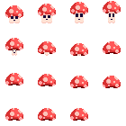

# Aprofundamento em LOVE

Ok, agora que já entendemos como funciona o básico do LÖVE, como sua inicialização, a leitura de inputs e a renderização de assets, vamos abordar alguns outros tópicos importantes para a criação de um bom jogo.

O plano é:

- Falaremos sobre como usar *Sprite Sheets* para criar animações;
- Depois, vamos falar sobre o uso de *Canvas* para renderizar certos elementos em suas próprias "janelas virtuais";
- Em seguida, vamos ver um pouco de *Particle Systems* (Sistemas de Partícula);
- Então, vamos falar um pouquito sobre *Threads* do LOVE, e
- Por fim, vamos bater um papinho final sobre desenvolvimento de jogos, Love2D, e para onde ir agora que você concluiu o curso.

Para explicar essas coisas, vou utilizar exemplos reais de um jogo que estou desenvolvendo, chamado "MushRooms". Contudo, como você - leitor - não possui o contexto inteiro do código do jogo, vou tomar o máximo de cuidado nas explicações e tentar não te deixar perdido.

Parece bom? Então bó

## Animações com Sprite Sheets

Na introdução a Love, nós vimos que é possível renderizar uma "animação" separando seus frames em imagens diferentes e então desenhando elas uma de cada vez. Contudo, esse processo é muito limitado, desorganizado e demorado. Ao invés de fazer isso toda vez que quisermos adicionar uma animação para nosso jogo, vamos usar a estratégia dos verdadeiros desenvolvedores de jogos: *_sprite sheets_*.

Sprite sheets são imagens que reúnem todos os frames de uma ou mais animações. Os frames ficam alinhados em fileiras e colunas, então o que nós fazemos para renderizar uma animação usando sprite sheets é iterar sobre essas fileiras de frames.



Então vamos ver na prática um exemplo de como sprite sheets são usadas em um sistema de animação. Aqui em baixo temos o código da declaração de uma classe "Animation", responsável por gerenciar animações em um jogo:

``` Lua
Animation = {}
Animation.__index = Animation

function Animation.new(frames, frameDur, looping, loopFrame, frameDim)
	local animation = setmetatable({}, Animation)

	-- atributos que variam
	animation.frames = frames       -- número de frames na animação
	animation.frameDur = frameDur   -- duração de cada frame em segundos
	animation.looping = looping     -- se a animação é ciclica ou não
	animation.loopFrame = loopFrame -- a partir de qual frame a animação é ciclica
	animation.frameDim = frameDim   -- dimensões de cada frame
	-- atributos fixos na instanciação
	animation.currFrame = 1         -- frame atual
	animation.timer = 0             -- tempo decorrido desde a última mudança de frame	
	
	return animation
end
```

Como você pode ver, os objetos dessa nossa classe vão guardar praticamente todas as informações necessárias para rodarmos uma animação (que possivelmente loopa a partir de um ponto arbitrário). A função construtora de animações, contudo, é um pouco mais complexa, vamos dar uma olhada nela:

``` Lua
function newAnimation(path, length, quadSize, frameDur, looping, loopFrame, frameDim)
	local sheetImg = love.graphics.newImage(path)
	local frames = {}
	local gap = 4
	local sWidth = sheetImg:getWidth()
	local sHeight = sheetImg:getHeight()
	local qWidth = quadSize.width
	local qHeight = quadSize.height
	local i = 0

	for y = 0, sHeight - qHeight, qHeight + gap do
		for x = 0, sWidth - qWidth, qWidth + gap do
			i = i + 1
			if i > length then goto createanimation end

			table.insert(frames, love.graphics.newQuad(x, y, qWidth, qHeight, sWidth, sHeight))
		end
	end

	::createanimation::
	return Animation.new(frames, frameDur, looping, loopFrame, frameDim)
end
```

Bom, para entendermos ela melhor, vamos ver o que é cada uma dessas variáveis que nós inicializamos no início da função:

- *sheetImg:* a imagem que contém a sprite sheet inteira, ela é criada usando a função `love.graphics.newImage()` que nós já vimos antes, passando-se o caminho para o arquivo da sprite sheet.
- *frames:* é uma lista de Quads (já vamos ver o que é isso), cada um representando a área na sprite sheet referente a um frame específico. Lembre-se que os frames ficam alinhados um do lado do outro na sprite sheet.
- *gap:* em muitas sprite sheets, incluindo as desse jogo, há um espaçamento entre os frames da animação, nesse caso o espaçamento é de 4 pixels.
- *sWidth:* a largura da sprite sheet em pixels.
- *sHeight:* a altura da sprite sheet em pixels.
- *qWidth:* a largura de cada frame (e portanto de cada `Quad`) em pixels.
- *qHeight:* a altura de cada frame (e portanto de cada `Quad`) em pixels.
- *i:* um contador que contabilizará frames.

A próxima parte do código - o loop duplo - não passa de uma etapa de preenchimento da array `frames` com os _Quads_ de cada frame. A palavra "Quads" vem de "quadrilátero". Ou seja, `Quads` são regiões quadriláteras de uma textura (imagem), e são a forma como nós subdividimos uma sprite sheet em seus frames. A função `love.graphics.newQuad()` cria um `Quad` para nós, recebendo como argumentos as coordenadas do quad na textura de referência, suas dimensões e as dimensões da textura de referência.

Em suma, esse loop duplo cria regiões retangulares que designam nossos frames, começando pelo canto superior esquerdo da sprite sheet e scaneando ela da esquerda para a direita, cima para baixo, até que o fim da imagem seja alcançado ou que `i` ultrapasse o número de frames da nossa animação. Ao fazer isso, os quads vão sendo colocados em nossa array `frames`, que posteriormente será útil como você bem verá.

